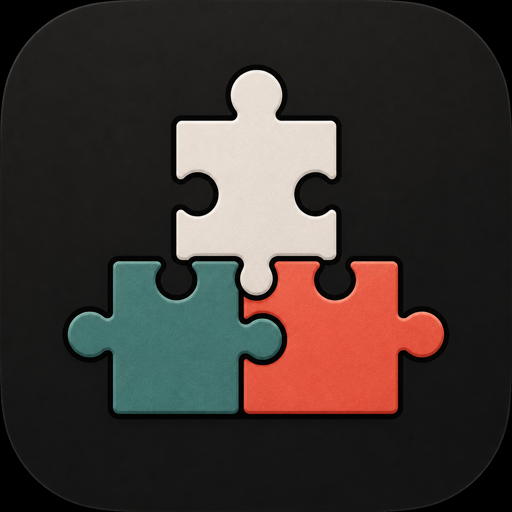
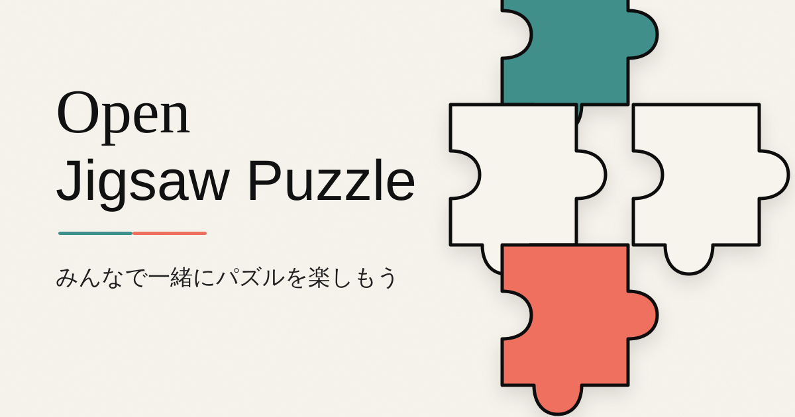

  
  <h1>Open Jigsaw Puzzle</h1>
  
<b>みんなで一緒にパズルを楽しもう</b>

  
ログイン不要。リンクを共有して、画像を選んで、みんなでジグソーパズルを解こう。

  
  
  
  
  

  

  

---

## スタック

| レイヤー         | 技術                                           |
| ---------------- | ---------------------------------------------- |
| フロントエンド   | Vite + SolidJS + TypeScript                    |
| スタイリング     | Panda CSS + Ark UI                             |
| API              | Hono on Cloudflare Workers                     |
| リアルタイム通信 | Durable Objects WebSocket + WebRTC DataChannel |
| メタデータ       | Cloudflare D1                                  |

画像はブラウザでリサイズされ、ピア間で P2P 転送される。サーバーには保存されない。

## 操作

- PC: ピースをドラッグして移動。空白をドラッグ、またはマウスホイールで盤面を移動・拡大縮小できる。
- モバイル/タブレット: 1本指でピースを移動、2本指でピース上からでも盤面をパン・ピンチズームできる。
- 右下のズームボタンでも拡大、縮小、全体表示を操作できる。

## ドキュメント

- [ローカル開発](docs/development.md)
- [デプロイ](docs/deployment.md)
- [無料枠の試算](docs/free-tier-estimate.md)
